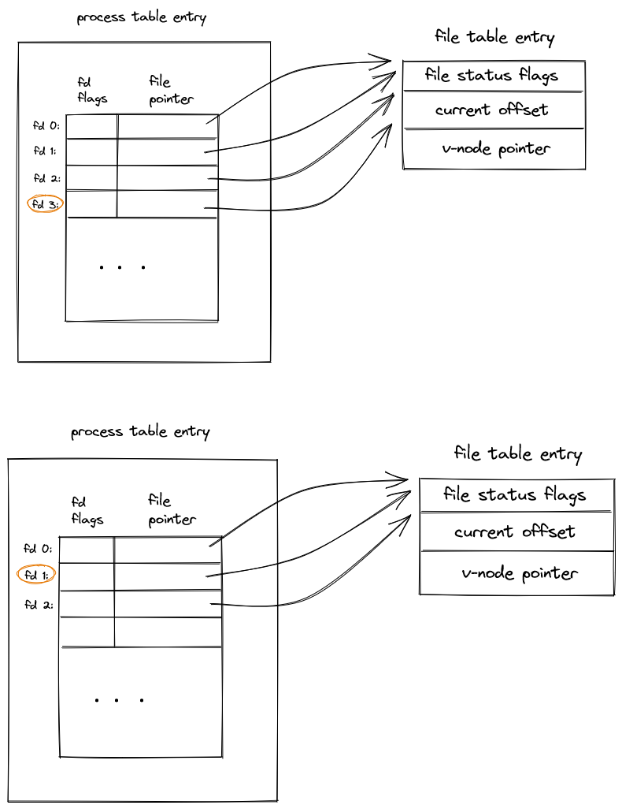

# Chapter 3 Exercises

## 3.1
Q:
When reading or writing a disk file, are the functions described in this chapter really unbuffered? Explain.

A:
No, as shown in previous data(Fig 3.6), `read` will read more data(buffer size change but time didn't change much); `write` also has its data queued in kernel waiting for flushing into disk.
But in the sense of system call, both will result in a system call, which is why it's called unbuffered IO.

## 3.2
Q:
Write your own `dup2` function thtat behaves the same way as the dup2 function described in Section 3.12, without calling the `fcntl` function. Be sure to handle errors correctly.

A:
The only way I can come up with given the restriction it's to keep duplicating the fd until it filled up to the required fd, and then closes those unneccessary ones. I can use `dup` or `open("/dev/fd/..")` to do this.

## 3.3
Q:
Assume that a process executes the following three function calls:
```C
fd1 = open(path, oflags);
fd2 = dup(fd1);
fd3 = open(path, oflags);
```
Draw the resulting picture, similar to Figure 3.9. Which descriptor are affected by an `fcntl` on `fd1` with a command of `F_SETFD`? Which descriptors are affected by an `fcntl` on `fd1` with a command of `F_SETFL`?

A:

- only `fd1` itself is affected by `F_SETFD`
- `fd1` and `fd2` since they shares the same open file entry. `fd3` has a seperate entry hence unaffected.

## 3.4
Q:
The following sequence of code has been observed in various programs:
```C
dup2(fd, 0);
dup2(fd, 1);
dup2(fd, 2);
if(fd > 2)
    close(fd);
```
To see why the `if` test is needed, assume that `fd` is 1 and draw a picture of what happens to the three descriptor entries and the corresponding file table entry with each call to  `dup2`. Then assume that `fd` is 3 and draw the same picture.

A:


If we did't add that condition, we may accidentally close one of the descriptors we just duplicated if `fd` <= 2.

## 3.5
Q:
The Bourne shell, Bourne-again shell, and Korn shell notation
```shell
digit1>&digit2
```
says to redirect descriptor `digit1` to the same file as descriptor `digit2`. What is the difference between the two commands shown below? (Hint: The shells process their command lines from left to right.)
```shell
./a.out > outfile 2>&1
./a.out 2>&1 > outfile
```

A:
- In the first case, we redirect `stdout`(1) to `outfile` (1 => `outfile`), then redirect `stderr`(2) to 1 (2 => `outfile`). It results in both fd 1 and 2 point to the same file `outfile`.
- In the second case, we redirect 2 to 1, which it's the `stdout` (2 => `stdout`), then redirect `stdout` to `outfile` (1 => `outfile`).

So, the difference is, in the second case, fd 2 is still pointing to `stdout` while in the first case it points to `outfile`.


## 3.6
Q:
If you open a file for read-write with the append flag, can you still read from anywhere in the file using `lseek`? Can you use `lseek` to replace existing data in the file? Write a program to verify this.

A:
- Yes, I can read from anywhere using `lseek`, but everytime I write, the current file offset is set to the end of file.
- No, the append flag will reset the current file offset to the end of file on write.
[code](./ex3.6p91.c)
